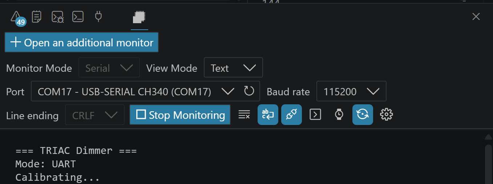
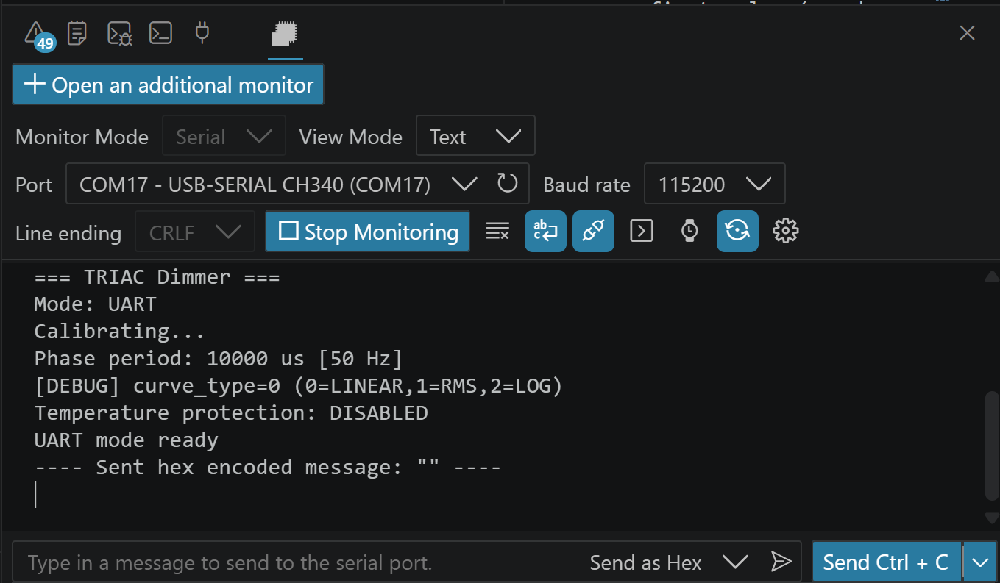
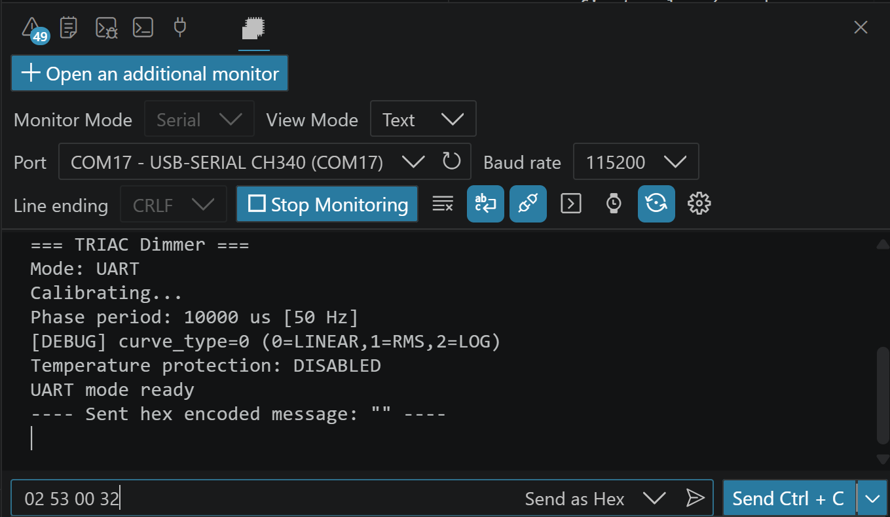
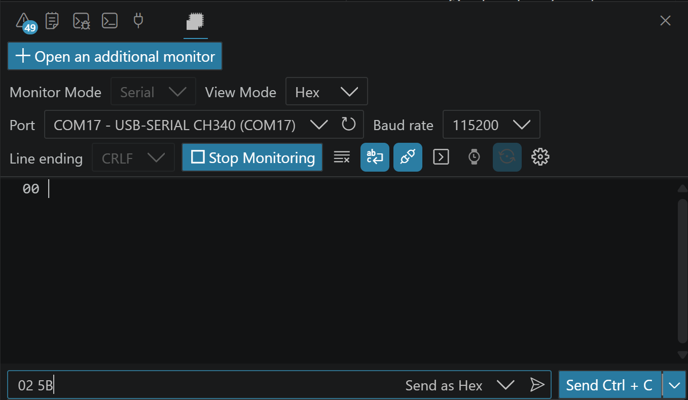

# Getting Started — Step by Step

> [!NOTE]
> A practical guide based on real user experience. Follow these steps to get DimmerLink working for the first time.

This guide applies to both the standalone DimmerLink module and the built-in DimmerLink controller inside a Dimmer module.

---

## Step 1: Connect to a Serial Terminal

By default, DimmerLink operates in **UART mode**. To verify it's working, connect DimmerLink to any **USB-UART adapter** such as CH340, CP2102, or CP2104.

Open a serial terminal that supports:
- HEX input/output mode
- Port configuration (baud rate, data bits, etc.)

**Recommended terminals:**
- VS Code — Serial Monitor extension
- Advanced Serial Port Monitor
- RealTerm, CoolTerm, SSCOM

> [!WARNING]
> Arduino IDE Serial Monitor does **not** support HEX mode. Do not use it with DimmerLink.

This guide uses VS Code Serial Monitor as an example.

### Port Settings

| Parameter | Value |
|-----------|-------|
| Baud Rate | 115200 |
| Data Bits | 8 |
| Parity | None (N) |
| Stop Bits | 1 |
| Format | **8N1** |

---

## Step 2: Power Up and See the Welcome Message

1. **Open the serial port** in your terminal first
2. **Then** connect DimmerLink to the USB-UART adapter (or power it on)

This order ensures you catch the startup message:

<p align="center">
  
</p>

You should see:
```
=== DimmerLink vX.XXX ===
Mode: UART
Calibrating...
```

---

## Step 3: Complete the Calibration

DimmerLink starts by calibrating the AC mains frequency. This is the **highest priority** task at startup — the controller waits for Zero-Cross events from the AC mains before accepting any commands.

**To complete calibration:**

1. Make sure the **dimmer module is connected to AC mains**. A load (lamp) is not required at this stage — only the mains connection matters.
2. **Restart DimmerLink** — disconnect VCC and reconnect it (or briefly short VCC to GND to trigger a reset).

After successful calibration you will see:

<p align="center">
  
</p>

The message shows:
- Detected mains frequency (50 Hz or 60 Hz)
- Phase period in microseconds
- Active dimming curve
- "UART mode ready"

> [!IMPORTANT]
> If the dimmer is not connected to AC mains, DimmerLink will stay in the "Calibrating..." state. Commands sent during calibration are received and buffered, but **will not be executed** until calibration completes.

> [!TIP]
> If the reported frequency does not match your mains (e.g., shows 60 Hz when your mains is 50 Hz), the calibration was inaccurate. Restart DimmerLink and try again.

---

## Step 4: Switch Console to HEX Mode

DimmerLink communicates using a **binary (HEX) protocol**. Before sending commands, switch your terminal's input mode to HEX.

<p align="center">
  
</p>

Now try setting brightness to 50%. Send this HEX command:

```
02 53 00 32
```

| Byte | Meaning |
|------|---------|
| `02` | Start byte (STX) |
| `53` | SET command ('S') |
| `00` | Dimmer index 0 |
| `32` | 50% brightness (0x32 = 50 decimal) |

---

## Step 5: Read the Response

DimmerLink responds in HEX format. Switch your terminal's **output display** to HEX mode to see the responses clearly.

<p align="center">
  
</p>

A response of `00` means the command was executed successfully.

| Response | Meaning |
|----------|---------|
| `00` | OK — command executed |
| `F9` | Syntax error — unknown command |
| `FC` | Flash write error |
| `FD` | Invalid dimmer index |
| `FE` | Invalid parameter value |

---

## Step 6: Switch to I2C Mode (Optional)

If you need I2C instead of UART, send the switch command:

```
02 5B
```

Response: `00` (OK — this is the last UART response).

After this, DimmerLink:
- Switches to I2C mode immediately
- Stops responding to UART commands
- Stops sending messages to the terminal
- Remembers the mode — after reboot it will start in I2C mode

> [!IMPORTANT]
> I2C mode requires **pull-up resistors** (typically 4.7K) on SDA and SCL lines. The default I2C address is **0x50**.

To switch back to UART from I2C, send command `0x03` to I2C register `0x01` (COMMAND register). See [I2C Communication](04_I2C_COMMUNICATION.md) for details.

---

## Quick Command Reference

| Action | HEX Command | Expected Response |
|--------|-------------|-------------------|
| Set 0% (off) | `02 53 00 00` | `00` |
| Set 25% | `02 53 00 19` | `00` |
| Set 50% | `02 53 00 32` | `00` |
| Set 75% | `02 53 00 4B` | `00` |
| Set 100% | `02 53 00 64` | `00` |
| Get brightness | `02 47 00` | `00` + level byte |
| Get mains frequency | `02 52` | `00 32` (50 Hz) or `00 3C` (60 Hz) |
| Set RMS curve | `02 43 00 01` | `00` |
| Switch to I2C | `02 5B` | `00` |

---

## Troubleshooting

| Symptom | Cause | Solution |
|---------|-------|----------|
| No startup message | Port opened after power-up | Open port first, then power on DimmerLink |
| Stuck on "Calibrating..." | Dimmer not connected to AC mains | Connect mains power, then restart DimmerLink |
| Commands not executing | Still in calibration | Wait for "UART mode ready" before sending commands |
| No response to commands | Terminal sending ASCII, not HEX | Switch console input to HEX mode |
| No response to commands | DimmerLink is in I2C mode | Reconnect via I2C and send SWITCH_UART command |
| Wrong frequency detected | Noisy restart | Power-cycle DimmerLink cleanly |

---

## Support

If you need technical assistance:
- Visit your account at [rbdimmer.com](https://www.rbdimmer.com/?utm_source=github&utm_medium=referral&utm_campaign=dimmerlink)
- Email: support@rbdimmer.com

---

## What's Next?

- [All UART Commands](03_UART_COMMUNICATION.md) — full protocol reference
- [I2C Interface](04_I2C_COMMUNICATION.md) — register map and examples
- [Hardware Connection](02_HARDWARE_CONNECTION.md) — wiring diagrams for popular boards
- [FAQ & Troubleshooting](07_FAQ_TROUBLESHOOTING.md) — common questions
