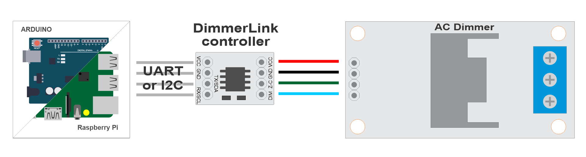

# Hardware Connection

Wiring diagrams for connecting DimmerLink to popular microcontrollers and single-board computers.

---

## DimmerLink Connectors

### Input Connector (to your project)

| Pin | Function | Description |
|-----|----------|-------------|
| VCC | Power | 1.8V, 3.3V or 5V DC |
| GND | Ground | Common ground |
| TX/SDA | Data | UART TX or I2C SDA |
| RX/SCL | Clock | UART RX or I2C SCL |

### Output Connector (to dimmer module)

| Pin | Function | Description |
|-----|----------|-------------|
| VCC | Power | Same as input |
| GND | Ground | Common ground |
| Z-C | Zero-Cross | Zero-crossing signal |
| Dim | Control | TRIAC gate signal |

---

## Compatibility

DimmerLink supports a wide range of supply voltages and logic levels:

| Voltage | VCC Power | Logic Levels |
|---------|-----------|--------------|
| **1.8V** | ✓ | ✓ |
| **3.3V** | ✓ | ✓ |
| **5.0V** | ✓ | ✓ |

> **✅ Direct connection to any microcontroller without level converters!**

---

## General Connection Diagram



```
┌─────────────────┐      ┌──────────────────┐      ┌─────────┐      ┌──────┐
│  Your Project   │      │   DimmerLink     │      │ Dimmer  │      │ Lamp │
│  (Arduino/RPi)  │◄────►│                  │◄────►│ (TRIAC) │◄────►│      │
└─────────────────┘      └──────────────────┘      └─────────┘      └──────┘
     UART/I2C                                         AC 220V
```

---

## Supported Platforms

DimmerLink works with any microcontroller that has UART or I2C interface.

| Platform | UART | I2C | Logic Level | Connection |
|----------|------|-----|-------------|------------|
| Arduino Uno/Nano | ✓ | ✓ | 5V | Direct |
| Arduino Mega | ✓ | ✓ | 5V | Direct |
| Arduino Due | ✓ | ✓ | 3.3V | Direct |
| ESP8266 | ✓ | ✓ | 3.3V | Direct |
| ESP32 | ✓ | ✓ | 3.3V | Direct |
| STM32 Blue Pill | ✓ | ✓ | 3.3V | Direct |
| Raspberry Pi Pico | ✓ | ✓ | 3.3V | Direct |
| Raspberry Pi 3/4/5 | ✓ | ✓ | 3.3V | Direct |
| Orange Pi | ✓ | ✓ | 3.3V | Direct |
| Banana Pi | ✓ | ✓ | 3.3V | Direct |
| ATtiny, nRF52, MSP430 | ✓ | ✓ | 1.8V | Direct |

**Any controller with UART or I2C connects directly!**

---

## I2C Connection

### Requirements

- **Pull-up resistors**: Many controllers already have I2C pull-ups. Add 4.7kΩ resistors on SDA and SCL to VCC
- **Speed**: 100 kHz (Standard Mode)
- **Address**: 0x50

### I2C Wiring Diagram


```
                    VCC (your board)
                     │
                ┌────┴────┐
               4.7kΩ     4.7kΩ
                │         │
┌───────────┐   │         │   ┌──────────────────┐
│           │   │         │   │   DimmerLink     │
│   Your    │───┴─────────│───│ SDA              │
│  Project  │             │   │                  │
│   SDA     │─────────────┴───│ SCL              │
│   SCL     │                 │                  │
│   GND     │─────────────────│ GND              │
│   VCC     │─────────────────│ VCC              │
└───────────┘                 └──────────────────┘
```

---

## Dimmer Connection

| DimmerLink | Dimmer | Description |
|------------|--------|-------------|
| VCC | VCC | Power (same as from MCU) |
| GND | GND | Common ground |
| Z-C | Z-C (Zero Cross) | Zero-crossing signal |
| Dim | DIM / PWM / Gate | TRIAC control signal |

---

## Arduino Uno / Nano

### I2C Connection

| Arduino | DimmerLink |
|---------|------------|
| A4 (SDA) | SDA |
| A5 (SCL) | SCL |
| GND | GND |
| 5V | VCC |

### UART Connection

| Arduino | DimmerLink |
|---------|------------|
| TX (1) or SoftwareSerial | RX |
| RX (0) or SoftwareSerial | TX |
| GND | GND |
| 5V | VCC |

> **📝 Note:** On Arduino Uno, pins 0/1 are used for USB. SoftwareSerial is recommended.

```cpp
#include <SoftwareSerial.h>
SoftwareSerial dimmerSerial(10, 11);  // RX, TX

void setup() {
    dimmerSerial.begin(115200);
}
```

---

## Arduino Mega

### I2C Connection

| Arduino Mega | DimmerLink |
|--------------|------------|
| 20 (SDA) | SDA |
| 21 (SCL) | SCL |
| GND | GND |
| 5V | VCC |

### UART Connection

| Arduino Mega | DimmerLink |
|--------------|------------|
| TX1 (18) | RX |
| RX1 (19) | TX |
| GND | GND |
| 5V | VCC |

Arduino Mega has 4 hardware UARTs (Serial, Serial1, Serial2, Serial3).

---

## ESP8266 (NodeMCU, Wemos D1)

### I2C Connection

| ESP8266 | DimmerLink |
|---------|------------|
| D2 (GPIO4) | SDA |
| D1 (GPIO5) | SCL |
| GND | GND |
| 3.3V | VCC |

### UART Connection

| ESP8266 | DimmerLink |
|---------|------------|
| TX (GPIO1) | RX |
| RX (GPIO3) | TX |
| GND | GND |
| 3.3V | VCC |

> **📝 Note:** GPIO1/GPIO3 are used for USB. Alternatives:
> - Use `Serial.swap()` to remap to GPIO15/GPIO13
> - Or use I2C instead of UART

---

## ESP32

### I2C Connection

| ESP32 | DimmerLink |
|-------|------------|
| GPIO21 | SDA |
| GPIO22 | SCL |
| GND | GND |
| 3.3V | VCC |

I2C pins can be remapped:

```cpp
Wire.begin(SDA_PIN, SCL_PIN);
```

### UART Connection

| ESP32 | DimmerLink |
|-------|------------|
| GPIO17 (TX2) | RX |
| GPIO16 (RX2) | TX |
| GND | GND |
| 3.3V | VCC |

ESP32 has 3 hardware UARTs (Serial, Serial1, Serial2).

---

## STM32 Blue Pill

### I2C Connection

| STM32 | DimmerLink |
|-------|------------|
| PB7 (I2C1 SDA) | SDA |
| PB6 (I2C1 SCL) | SCL |
| GND | GND |
| 3.3V | VCC |

### UART Connection

| STM32 | DimmerLink |
|-------|------------|
| PA9 (USART1 TX) | RX |
| PA10 (USART1 RX) | TX |
| GND | GND |
| 3.3V | VCC |

---

## Raspberry Pi Pico

### I2C Connection

| Pico | DimmerLink |
|------|------------|
| GP4 (I2C0 SDA) | SDA |
| GP5 (I2C0 SCL) | SCL |
| GND | GND |
| 3V3 | VCC |

### UART Connection

| Pico | DimmerLink |
|------|------------|
| GP0 (UART0 TX) | RX |
| GP1 (UART0 RX) | TX |
| GND | GND |
| 3V3 | VCC |

---

## Raspberry Pi 3/4/5

### I2C Connection

| Raspberry Pi | DimmerLink |
|--------------|------------|
| GPIO2 (Pin 3) | SDA |
| GPIO3 (Pin 5) | SCL |
| GND (Pin 6) | GND |
| 3.3V (Pin 1) | VCC |

**Enabling I2C:**

```bash
sudo raspi-config
# Interface Options → I2C → Enable
```

### UART Connection

| Raspberry Pi | DimmerLink |
|--------------|------------|
| GPIO14 (Pin 8) | RX |
| GPIO15 (Pin 10) | TX |
| GND (Pin 6) | GND |
| 3.3V (Pin 1) | VCC |

**Enabling UART:**

```bash
sudo raspi-config
# Interface Options → Serial Port → Enable
```

---

## Orange Pi / Banana Pi

Connection is similar to Raspberry Pi, but GPIO numbers may differ.

### Orange Pi (e.g., Orange Pi Zero)

> ⚠️ **Warning:** GPIO pinout differs between models! Check your specific board's documentation.

General principle:
1. Find I2C pins in your board's documentation
2. Connect SDA → SDA, SCL → SCL
3. Add 4.7kΩ pull-up resistors

| Orange Pi | DimmerLink |
|-----------|------------|
| PA12 (TWI0-SDA) | SDA |
| PA11 (TWI0-SCL) | SCL |
| GND | GND |
| 3.3V | VCC |

### Banana Pi (e.g., Banana Pi M2)

| Banana Pi | DimmerLink |
|-----------|------------|
| GPIO2 (Pin 3) | SDA |
| GPIO3 (Pin 5) | SCL |
| GND | GND |
| 3.3V | VCC |

> **📝 Note:** Check documentation for your specific Orange Pi / Banana Pi model.

---

## I2C Pull-up Resistors

For reliable I2C operation, pull-up resistors are required.

### When External Pull-ups Are Needed

| Board | Built-in Pull-ups | Recommendation |
|-------|-------------------|----------------|
| Arduino | Weak (~50kΩ) | Works on short wires, but 4.7kΩ recommended |
| ESP8266/ESP32 | Weak | Add external 4.7kΩ |
| Raspberry Pi | Has 1.8kΩ | Usually sufficient |
| STM32 | None | Must add external |

### Calculating Value

- **Short wires (< 10 cm)**: 4.7kΩ - 10kΩ
- **Medium wires (10-50 cm)**: 2.2kΩ - 4.7kΩ
- **Long wires (> 50 cm)**: 1kΩ - 2.2kΩ (not recommended)

---

## Installation Recommendations

1. **Keep wires short** — I2C is sensitive to length, keep wires under 30 cm
2. **Shielding** — For long runs, use shielded cable
3. **Separate power** — Use separate power supply for DimmerLink if main supply is unstable
4. **Decoupling** — Add 100nF capacitor between VCC and GND near DimmerLink

---

## Connecting to Other Controllers

DimmerLink works with **any microcontroller** that has UART or I2C:

- **PIC**: Connect to MSSP (I2C) or EUSART (UART)
- **AVR (ATmega, ATtiny)**: TWI for I2C, USART for UART
- **MSP430**: eUSCI modules
- **nRF52**: TWIM/UARTE peripherals
- **RISC-V (ESP32-C3, GD32VF103)**: Standard I2C/UART

General principle:
1. Find I2C/UART pins in documentation
2. Connect according to tables above
3. Add pull-ups for I2C
4. Done!

---

## What's Next?

- [UART Commands](03_UART_COMMUNICATION.md)
- [I2C Registers](04_I2C_COMMUNICATION.md)
- [Raspberry Pi Connection](05_SINGLE_BOARD_COMPUTERS.md)
