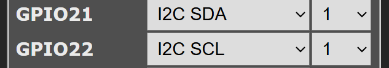
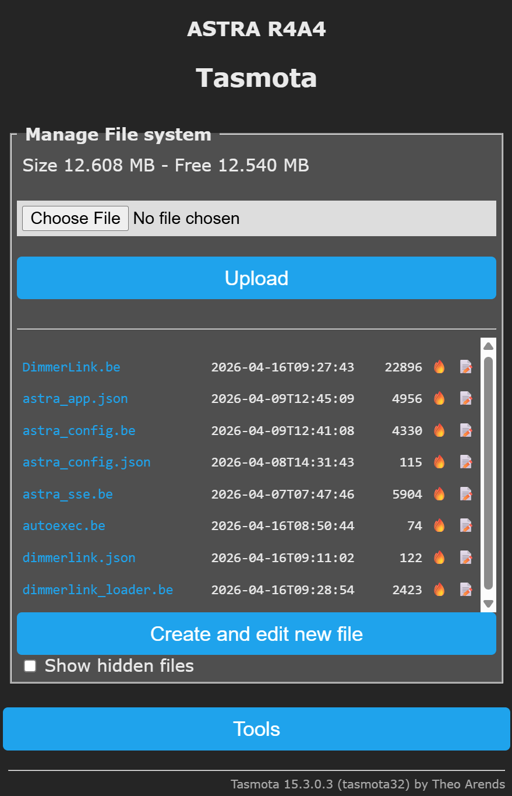
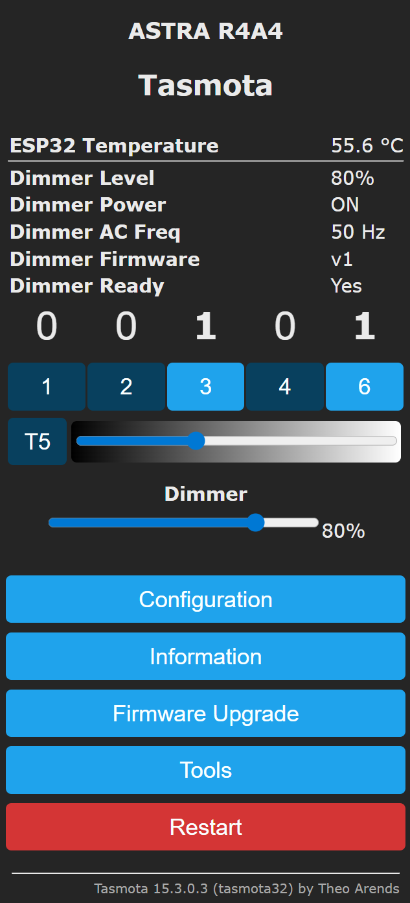

# Getting Started

## What is DimmerLink?

DimmerLink is a Berry driver that connects MCU TRIAC AC dimmer hardware to Tasmota via I2C. It provides:

- Brightness sliders in the Tasmota web dashboard
- Control via Tasmota commands (console, HTTP, MQTT)
- Sensor telemetry (brightness level, AC frequency, temperature)
- Preset brightness levels (night, low, mid, high, full)

## Requirements

| Component | Details |
|-----------|---------|
| **Tasmota firmware** | `tasmota32` or `tasmota32-berry` (any ESP32 build with Berry support) |
| **Hardware** | ESP32 board + MCU DimmerLink module(s) |
| **I2C wiring** | SDA, SCL, GND, VCC with **4.7kΩ pull-up resistors** on SDA and SCL |
| **I2C pins** | Must be configured in Tasmota: **Configuration > Configure Module** |

## Driver Files

The driver consists of 3 files:

| File | Purpose | Where to get |
|------|---------|-------------|
| `DimmerLink.be` | Main driver class — I2C communication, commands, web UI, telemetry | Required |
| `dimmerlink_loader.be` | Auto-loader — reads config, creates instances, registers presets | Required |
| `dimmerlink.json` | Device configuration — addresses, labels, channels, presets | Auto-generated on first boot |

## Installation

### Step 1: Configure I2C pins

In Tasmota web UI: **Configuration > Configure Module**

Assign two GPIO pins:
- One pin as **I2C SDA**
- One pin as **I2C SCL**

Save and restart.

<p align="center"></p>

### Step 2: Upload driver files

Go to **Consoles > Manage File System**

Upload these files (one at a time):
1. `DimmerLink.be`
2. `dimmerlink_loader.be`

<p align="center"></p>

### Step 3: Add to autoexec.be

In **Manage File System**, open `autoexec.be` for editing (or create it if it doesn't exist).

Add this line at the end:

```berry
load('dimmerlink_loader.be')
```

If you already have other lines in `autoexec.be`, just add this one after them:

```berry
# existing lines...
load('some_other_script.be')
# add DimmerLink loader
load('dimmerlink_loader.be')
```

### Step 4: Restart

Click **Restart** in the Tasmota web UI, or send the command:

```
Restart 1
```

### Step 5: Verify

After restart, open the Tasmota main page. You should see:

- A **brightness slider** for each DimmerLink device
- **Sensor data** showing brightness level, AC frequency, firmware version

In the console (**Consoles > Console**), you should see:

```
I2C: DimmerA detected on bus 0
DimmerLink: 1 device(s)
```

<p align="center"></p>

## What happens on first boot?

When the loader runs for the first time and no `dimmerlink.json` exists:

1. It scans all I2C buses for DimmerLink devices (identified by VERSION register = 0x01)
2. Creates a configuration file `/dimmerlink.json` with auto-detected devices
3. Assigns labels automatically: `DimmerA`, `DimmerB`, `DimmerC`, etc.
4. Creates default presets: night (10%), low (25%), mid (50%), high (75%), full (100%)

You can edit `dimmerlink.json` later to customize labels and settings.

## Uninstalling

To remove DimmerLink:

1. Remove `load('dimmerlink_loader.be')` from `autoexec.be`
2. Delete `DimmerLink.be`, `dimmerlink_loader.be`, and `dimmerlink.json` from the file system
3. Restart
