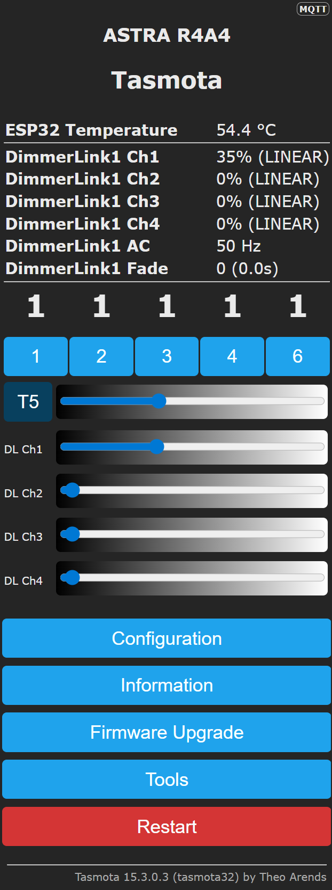

# Web UI, MQTT & HTTP — DimmerLink Native Tasmota Driver

## Web UI usage

### Dashboard

<p align="center"></p>

### Brightness sliders

When one or more DimmerLink devices are detected, the Tasmota main page (`http://<device-ip>/`) displays a brightness slider for each active channel.

The slider layout is:

- For a **single device**, sliders are labeled `DL Ch1`, `DL Ch2`, etc.
- For **multiple devices**, sliders are labeled `DL1 Ch1`, `DL1 Ch2`, `DL2 Ch1`, etc.

Sliders range from 0 (off) to 100 (full brightness). Dragging the slider and releasing sends a `DlDim` command to the corresponding channel. The slider reflects the current brightness level stored in the driver and updates when the level changes from any source (command, MQTT, etc.).

### Sensor display

The sensor section of the main page shows a read-only status table for each device:

| Row label | Value shown | Example |
|-----------|-------------|---------|
| `DimmerLink1 Ch1` | Brightness and curve | `75% (LOG)` |
| `DimmerLink1 Ch2` | Brightness and curve | `30% (RMS)` |
| `DimmerLink1 AC` | Detected mains frequency | `50 Hz` |
| `DimmerLink1 Fade` | Fade time (raw and seconds) | `10 (1.0s)` |
| `DimmerLink1 Temp` | Temperature and thermal state | `42 C (NORMAL)` |

The `Temp` row appears only if the temperature feature is available on the hardware. All rows update on each web page refresh; the sensor section is not a live push feed.

---

## MQTT telemetry

### Telemetry publication

The driver contributes to Tasmota's periodic `tele/<topic>/SENSOR` message (the `FUNC_JSON_APPEND` hook). The telemetry interval is controlled by Tasmota's `TelePeriod` setting (default 300 seconds).

### JSON structure — single device

```json
{
  "Time": "2026-04-16T12:00:00",
  "DimmerLink1": {
    "Addr": "0x50",
    "ACFreq": 50,
    "Fade": 10,
    "Ch1": {"Level": 75, "Curve": "LOG"},
    "Ch2": {"Level": 30, "Curve": "RMS"},
    "Ch3": {"Level": 0, "Curve": "LINEAR"},
    "Ch4": {"Level": 0, "Curve": "LINEAR"},
    "Temp": 42,
    "Thermal": "NORMAL"
  }
}
```

### JSON structure — multiple devices

When multiple devices are present, all appear as separate keys in the same SENSOR message:

```json
{
  "Time": "2026-04-16T12:00:00",
  "DimmerLink1": {
    "Addr": "0x50",
    "ACFreq": 50,
    "Fade": 0,
    "Ch1": {"Level": 75, "Curve": "LINEAR"},
    "Ch2": {"Level": 0, "Curve": "LINEAR"},
    "Ch3": {"Level": 0, "Curve": "LINEAR"},
    "Ch4": {"Level": 0, "Curve": "LINEAR"}
  },
  "DimmerLink2": {
    "Addr": "0x51",
    "ACFreq": 50,
    "Fade": 5,
    "Ch1": {"Level": 50, "Curve": "LOG"},
    "Ch2": {"Level": 0, "Curve": "LINEAR"},
    "Ch3": {"Level": 0, "Curve": "LINEAR"},
    "Ch4": {"Level": 0, "Curve": "LINEAR"}
  }
}
```

### Field descriptions

| Field | Type | Description |
|-------|------|-------------|
| `Addr` | string | I2C address in hex, e.g. `"0x50"` |
| `ACFreq` | integer | Detected mains frequency, 50 or 60 Hz |
| `Fade` | integer | Current fade time setting (0-255, units of 100ms) |
| `Ch1` ... `Ch4` | object | Per-channel data |
| `Ch1.Level` | integer | Brightness in percent (0-100) |
| `Ch1.Curve` | string | Dimming curve: `"LINEAR"`, `"RMS"`, or `"LOG"` |
| `Temp` | integer | Temperature in Celsius (only if hardware supports it) |
| `Thermal` | string | Thermal protection state (only with temperature sensor) |

The `Temp` and `Thermal` fields are omitted if the MCU firmware does not have `FEATURE_TEMPERATURE` enabled, or if the temperature register returns `0xFF`.

### Sending commands via MQTT

Commands are sent to `cmnd/<topic>/<Command>` with the payload as the argument:

```
Topic:   cmnd/my-device/DlDim
Payload: 75

Topic:   cmnd/my-device/DlDim
Payload: 2,30

Topic:   cmnd/my-device/DlCurve
Payload: 2

Topic:   cmnd/my-device/DlFade
Payload: 10
```

Command responses are published to `stat/<topic>/RESULT`:

```json
{"DlDim1":{"Ch1":75,"Ch2":30,"Ch3":0,"Ch4":0}}
```

---

## HTTP API

All Tasmota commands are accessible via HTTP GET using the `/cm` endpoint.

### Syntax

```
http://<device-ip>/cm?cmnd=<Command>%20<argument>
```

The space between command and argument must be URL-encoded as `%20`.

### Examples with curl

```bash
# Set device 1, channel 1 to 75%
curl "http://192.168.1.100/cm?cmnd=DlDim%2075"

# Set device 1, channel 2 to 30%
curl "http://192.168.1.100/cm?cmnd=DlDim%202,30"

# Set device 2, channel 1 to 50%
curl "http://192.168.1.100/cm?cmnd=DlDim2%2050"

# Set dimming curve to LOG on channel 1
curl "http://192.168.1.100/cm?cmnd=DlCurve%202"

# Set fade time to 1 second (value 10)
curl "http://192.168.1.100/cm?cmnd=DlFade%2010"

# Query full status of device 1
curl "http://192.168.1.100/cm?cmnd=DlStatus"

# Query full status of device 2
curl "http://192.168.1.100/cm?cmnd=DlStatus2"

# Recalibrate AC frequency on device 1
curl "http://192.168.1.100/cm?cmnd=DlRecalibrate"

# Change device 1 I2C address to 0x51
curl "http://192.168.1.100/cm?cmnd=DlAddress%200x51"
```

### Response format

All responses are JSON, returned with HTTP 200:

```json
{"DlDim1":{"Ch1":75,"Ch2":30,"Ch3":0,"Ch4":0}}
```

Error response (invalid device number, out of range argument, etc.):

```json
{"Command":"Error"}
```
